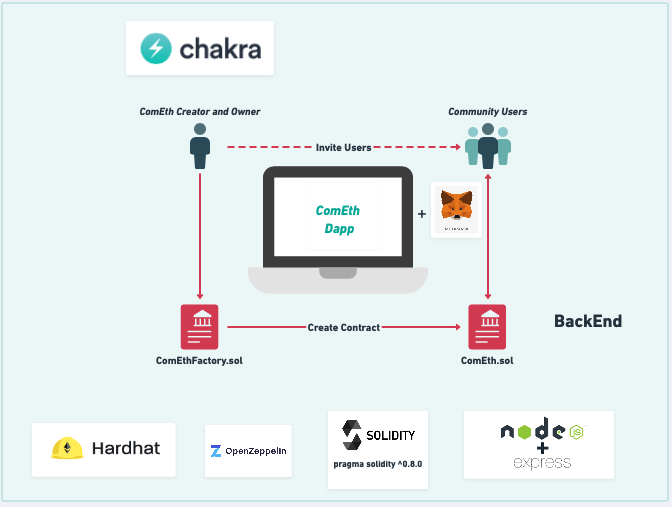

# ComEth Dapp BackEnd Architecture

## Architecture version 0.1





### Install the Repository :

```zsh
git clone https://github.com/Benmissi-A/ComEth
yarn
```

### Test librairies :

- Ethers Js
- Chai


### You need to add at your environment a file neme .env :

```
INFURA_PROJECT_ID=""
DEPLOYER_PRIVATE_KEY=""
```
